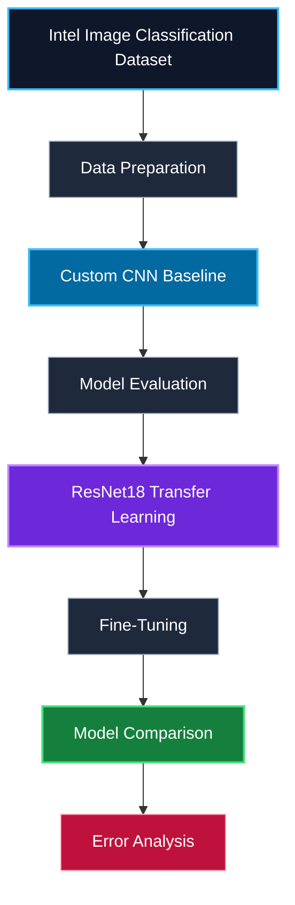
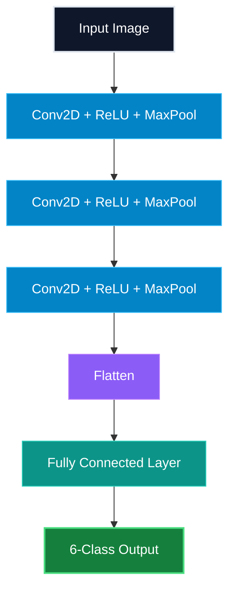

# Robust Image Classification with Transfer Learning and Model Comparison

<p align="center">
  <b>Image Classification • Transfer Learning • ResNet18 • PyTorch • Computer Vision</b>
</p>

<p align="center">
  
  
  
  
  
  
</p>

## Overview

This project investigates **image classification using deep learning and transfer learning** on the Intel Image Classification dataset.

Two different approaches were implemented and compared:

* A custom CNN trained from scratch
* A pretrained ResNet18 using transfer learning

The ResNet18 model was then **fine-tuned** to investigate whether adapting deeper pretrained features could further improve classification performance.

The project therefore follows a complete experimental workflow:


---

## Dataset

### Intel Image Classification

The project uses the **Intel Image Classification dataset**, containing six natural scene categories:

* Buildings
* Forest
* Glacier
* Mountain
* Sea
* Street

### Dataset Structure

| Split             |  Images |
| ----------------- | ------: |
| Training          | ~14,000 |
| Validation / Test |   3,000 |

Images were resized to **224 × 224 pixels** before being passed to the models.

---

## Models

### 1. Custom CNN

A convolutional neural network was implemented from scratch.

The architecture contains three convolutional blocks followed by fully connected layers:



The model was trained using:

* Cross-Entropy Loss
* Adam optimizer
* Learning rate: `0.001`
* Batch size: `32`
* 5 training epochs

---

### 2. ResNet18 Transfer Learning

A pretrained **ResNet18** model was used as the second approach.

The pretrained convolutional backbone was initially frozen and a new classification layer was added for the six target classes.

```text
Pretrained ResNet18
        ↓
 Frozen Feature Extractor
        ↓
 New Fully Connected Layer
        ↓
 6-Class Classification
```

This experiment achieved significantly better validation performance than the custom CNN baseline.

---

### 3. ResNet18 Fine-Tuning

After transfer learning, the final ResNet18 block was unfrozen and fine-tuned together with the classification layer.

```text
Pretrained ResNet18
        ↓
 Frozen Early Layers
        ↓
 Trainable Final Block
        ↓
 Trainable Classifier
        ↓
 6-Class Output
```

A lower learning rate of `0.0001` was used during fine-tuning.

---

## Experimental Results

### Model Comparison

| Model                        | Validation Accuracy |
| ---------------------------- | ------------------: |
| Custom CNN                   |          **79.83%** |
| ResNet18 — Transfer Learning |          **90.97%** |
| ResNet18 — Fine-Tuning       |          **93.43%** |

The results show a clear improvement when using pretrained features.

Compared with the custom CNN baseline:

* Transfer Learning improved validation accuracy by approximately **11 percentage points**
* Fine-Tuning improved validation accuracy by approximately **13.6 percentage points**

---

## Training Results

### Custom CNN

| Epoch | Train Accuracy | Validation Accuracy |
| ----: | -------------: | ------------------: |
|     1 |         59.81% |              65.67% |
|     2 |         74.38% |              76.10% |
|     3 |         81.67% |              79.50% |
|     4 |         87.49% |              79.60% |
|     5 |         93.32% |              79.83% |

The increasing gap between training and validation accuracy indicates that the custom CNN begins to show signs of **overfitting**.

---

### ResNet18 Transfer Learning

| Epoch | Train Accuracy | Validation Accuracy |
| ----: | -------------: | ------------------: |
|     1 |         84.07% |              89.87% |
|     2 |         89.41% |              90.40% |
|     3 |         89.76% |              90.67% |
|     4 |         90.34% |          **90.97%** |
|     5 |         90.63% |              90.87% |

---

### ResNet18 Fine-Tuning

| Epoch | Train Accuracy | Validation Accuracy |
| ----: | -------------: | ------------------: |
|     1 |         90.97% |              92.63% |
|     2 |         96.93% |              92.73% |
|     3 |         98.56% |              93.20% |
|     4 |         99.03% |          **93.43%** |
|     5 |         99.23% |              92.93% |

The best validation accuracy was **93.43% at epoch 4**.

The slight decrease after epoch 4 suggests the beginning of overfitting during continued fine-tuning.

---

## Classification Performance

The final evaluation achieved approximately **93% accuracy**.

| Class     | Precision | Recall | F1-Score |
| --------- | --------: | -----: | -------: |
| Buildings |      0.93 |   0.93 |     0.93 |
| Forest    |      1.00 |   0.97 |     0.99 |
| Glacier   |      0.92 |   0.86 |     0.89 |
| Mountain  |      0.88 |   0.90 |     0.89 |
| Sea       |      0.93 |   0.98 |     0.95 |
| Street    |      0.94 |   0.93 |     0.94 |

**Overall Accuracy: 93%**

---

## Confusion Analysis

The baseline CNN showed several important class confusions, particularly between visually similar environments.

The strongest confusion patterns included:

* Glacier ↔ Mountain
* Sea → Glacier
* Sea → Mountain
* Buildings → Street
* Street → Buildings

These errors are expected because several scene categories share similar visual characteristics.

Transfer learning with ResNet18 substantially improved the classification performance across the six categories.

---

## Key Findings

The experiments demonstrate three important observations:

### 1. A custom CNN provides a strong baseline

The CNN achieved approximately **80% validation accuracy** after only five epochs.

### 2. Transfer learning provides a significant improvement

Using pretrained ResNet18 features increased validation accuracy to approximately **91%**.

### 3. Fine-tuning improves the model further

Fine-tuning the final ResNet18 block increased the best validation accuracy to **93.43%**.

This demonstrates the benefit of adapting pretrained visual features to the target dataset.

---

## Technologies

<p align="center">
  
  
  
  
  
  
</p>

---

## Skills Demonstrated

* Deep Learning
* Image Classification
* Convolutional Neural Networks
* Transfer Learning
* Fine-Tuning
* ResNet18
* PyTorch
* Torchvision
* Model Evaluation
* Classification Reports
* Confusion Matrix Analysis
* Overfitting Analysis
* Experimental Model Comparison

---

## Project Structure

```text
robust-image-classification-transfer-learning/
│
├── README.md
├── LICENSE
├── .gitignore
├── requirements.txt
│
└── notebook/
    └── image_classification.ipynb
```

---

## Future Work

Possible improvements include:

* Data augmentation
* Learning-rate scheduling
* Additional pretrained architectures
* Deeper hyperparameter optimization
* Class-specific error analysis
* Early stopping
* Comparison with EfficientNet and Vision Transformers

---

## Author

**Meriem Tafraoui**

AI Engineering Student
Université Mustapha Stambouli, Mascara, Algeria
